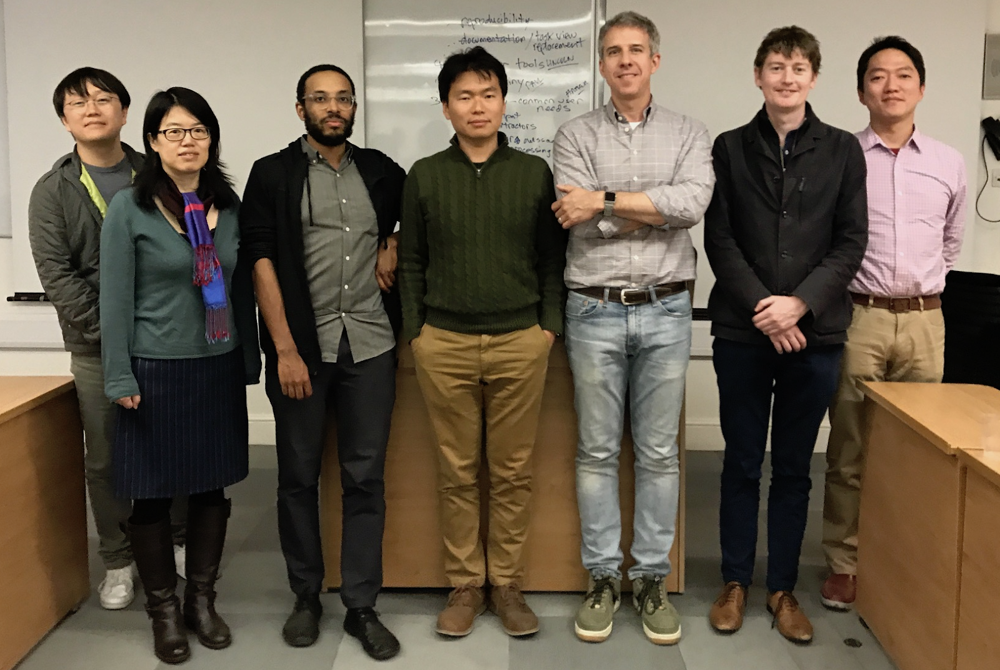

```{r setup, include=FALSE}
knitr::opts_chunk$set(echo = TRUE)
```

```{r include=FALSE}
require(quanteda)
```

#本講座について

##自己紹介

###渡辺耕平

ロンドン経済大学（LSE）の方法論学部で博士号を取得した後に，先月まで同学部で研究員として働いた．現在は，早稲田大学の高等研究所に所属している．

- 国際コミュニケーションおよび政治コミュニケーションが専門
    - ロシア政府による国内・国外に対するプロパガンダの手法の研究
    - アメリカについての認識を同盟関係（日本，アメリカ，ドイツなど）の新聞の分析を通じて研究
    - https://koheiw.net/
- 量的テキスト分析ツール（quanteda）の開発者
    - https://github.com/koheiw
- アジア言語における量的テキスト分析の普及に向けて活動中

##量的テキスト分析とは

社会・人文科学的におけるコンピューターを用いた文書の分析

- Rおよび統計分析についての基本的な知識が必要だが，
    - プログラミングを行うわけではない
    - 統計なしでも量的テキスト分析はできる
- 非常に複雑な分析手法が使われることもあるが，
    - 大切なのは新しい視点から文書を分析すること
    - より単純な方法が好まれる
        
##講座の目標

1. 英語の文書に対する前処理から統計分析までの流れを理解する．
2. 日本語を英語と同様な方法で分析するための特別な前処理を理解する．
3. 政治学的な研究のために英語および日本語の文書を統計的に分析できるようになる．
4. 量的テキスト分析結果を説得に提示できるようになる．

##構成

第1日目

- 講義：量的テキスト分析の歴史および理論的な背景（90分）
- 実習１：Rの基本からコーパスの操作（90分）

第2日目

- 実習２（90分）
- 実習３（90分）

第3日目

- 作業（180分）
- 発表（90分）

##注意点

##講義の内容

1. 量的テキスト分析の技術的な背景
2. 量的テキスト分析を用いた研究
3. 量的テキスト分析の手法
4. 文書データの特徴
5. 量的テキスト分析のツール

#量的テキスト分析の技術的な背景

##自然言語処理

量的テキスト分析は自然言語処理（~ natural language processing）の技術を社会・人文科学的な情報を抽出のために応用したものだと考えることができる．

- 自然言語処理技術の応用例
    - 翻訳
    - 検索（Webおよびデータベース）
    - 情報抽出（視覚化やデーターマイニング）
    - 文書要約（ニュース記事）
    - 質疑応答

##自然言語処理の研究の歴史

- 1940s
    - 世界大戦中の暗号解読の経験に基づき自動翻訳の研究が始まった．
- 1950-1960s: 
    - 統計的な手法が開発される一方で，生成文法などの言語理論が登場し，それらに基づくプロトタイプが登場した．
    - アメリカで公的な研究資金の提供が停止するが，政府機関はロシア語の翻訳のために機械翻訳の利用を続けた．
- 1970-1980s
    - 文書が生成された目的や文脈を考慮しながら，より実用性を重視したプログラムのための研究が行われるようになった．
- 1990s
    - コンピューターの性能の向上，電子的データの増加，インターネットの登場によって技術が急速に発展した．
- 2000-2010s:
    - ニューラルネットワークなどの機械学習を用いた手法が急速に発展しつつある．

##量的テキスト分析の発展

- 1950-1960s: メインフレーム上で辞書分析を行うシステムが開発された
    - General Inquirerシステムおよび辞書 (Stone et al. 1966)
        - Hravard III Psychosociological Dictionary
        - Santa Fe Anthropological Dictionary
        - Stanford Political Dictionary  
- 1970-1980s: 複数の量的テキスト分析用の辞書が作成された
    - The Regressive Imagery Dictionary (Martindale 1975)
    - DICTION (North et al. 1984)
- 1990s: 大規模コーパスの統計的な分析手法が開発された
    - Latent Semantic Analysis (Deerwester et al. 1990)
- 2000-2010s: さまざまなテキスト分析に利用できる機械学習モデルが開発された
    - Wordscores (Laver et al. 2003)
    - Latent Dirichlet allocation (Blei 2003)
    - Wordfish (Slapin and Proksch, 2008)

#量的テキスト分析を用いた研究

##量的テキスト分析の目的と方法

###目的

社会・人文科学の理論的な観点から興味深いパターンをコーパスの中に発見する

###方法

- 社会・人文科学はより高次の言語現象に注目する
    - 低次（形態素，語彙，係り受け，語の意味）
    - 高次（言説，語用）
- 高次の言語現象を分析するのための手法は，人が言語を理解する方法とは必ずしも一致しない
    - 複雑な統計的な学習モデルを用いる必要は無い

##内容分析とテキスト分析

量的テキスト分析は，統計的な処理を目的とする内容分析と多くの点で一致するが，人による内容分析の自動化が目的ではない．

- 人間: 少数の文書しか読むことができないが，文の深い意味を理解することで，言説を明らかにする．
- 機械: 文の深い意味を理解できないが，多数の文書を系統的に処理することで，言説を明らかにする．

量的テキスト分析の結果は，研究者の実社会について知識に基づいて解釈されない限り、社会・人文科学的な意味をなさない点では，内容分析と同じ．

- コンピューターを用いた内容分析は"automated content analysis"と呼ばれることがあるが，Krippendorffに言わせると"computer-assisted content analysis" に過ぎない．

##文書データを分析する意図

- 文書の内容の検証
    - 文書の系統的な分析を通じて，特定の主題に関する記述の傾向を検証する．
        - 社会的少数派に関する新聞記事を分析して報道の公平性を検証する．
- 文書の影響力の検証
    - 文書を社会的な反応を示すデータと併せて分析することで，その影響を推定する．
        - 国際ニュースを外国に関する世論調査のデータと併せて分析することで，メディアの世論形成の力を推定する．
- 文書を代理とした測定
    - 文書を通じて直接には測定できない社会現象を測定する．
        - 新聞記事を過去に遡って分析することで，特定の主題に関する世論の歴史的な変化を計測する．
        - ツイートを一定期間継続的に分析することで，特定の主題に関する態度の変化を測定する．
- 文書からの真意の推測    
    - 文書の内容を，筆者の意識を反映とみなし，文書データの系統的な分析を通じて，真の意図を推測する．
        - 政党や政治家の選好を選挙公約や議会議事録を通じて推測する．
        - 国営の外国向けニュースを分析することで，その国の外交戦略の優先課題を推測する．

##量的テキスト分析の流れ

1. 課題を特定
2. データ収集（アーカイブやウェブサイトからコーパス構築）
3. 前処理
    - 文書単位の変更（必要であれば文書を段落や文節に分割）
    - トークン化（文を語に分割）
    - 特徴選択（重要な語を選択）
4. データ分析
    - 文書データに対する分析（辞書分析やトピックモデルなどを適用）
    - データの集計・統合（必要であれば文書からのデータを加える）
    - 数値データに対する分析（相関分析や回帰分析）
5. 結果の解釈

##データ収集

- データ収集には母集団についての知識が不可欠
    - 代表性のあるコーパスの構築は非常に難しい
- 異なる標本を得て，比較分析を行う
    - 違う情報源から同じ基準でデータを収集する
        - 朝日新聞と読売新聞のアメリカについての記事
    - 同じ情報源から違う基準でデータを収集する
        - 朝日新聞の中国とアメリカについての記事
- 量的テキスト分析のためには大きなコーパスが必要
    - 頻度が5回以下の事象は統計的に信頼できない
    - 辞書分析や生成モデルは小さなコーパスにも適用できる

##情報源

###ウェブAPI

- APIはRパッケージを通じて容易に利用できる
    - Twitter Streaming API (streamR)
    - New York Times API (rtimes)
    - 国会議事録API ([kaigiroku](https://github.com/amatsuo/kaigiroku))

###ウェブサイト

- ウェブサイトからのデータ収集にはスクレイピングを行う（~ scraping）
    - 静的なサイト: HTMLをHTTP経由でダウンロードする（rvest）
    - 動的なサイト: Seleniumを用いてブラウザを通じてダウンロードする（RSelenium）
        - 主要なオンラインサービス
        - 商用データーベース

##量的テキスト分析の種類

###記号的アプローチ

分析者の知識に基づいて事前に作成された辞書などを用いて文書を分析する

- 分析結果が分析者の知識に大いに依存する
- コーパスの大きさに関係なく適用できる
- 技術的に単純で計算量が少ない

###統計的アプローチ

わずかな事前の知識だけで統計モデルを用いて文書を分析する

- 統計モデルの特性に分析結果が依存する
- ある程度大きなコーパスが必要
- 技術的に高度で計算量も多い

##文書データ分析の基本方針

- 適切なトークン化によって意味のある変数を生成する
    - 空白による分割は，フレーズや固有名などの複合表現（~ muli-word expressions）を正しくトークン化しない．
    - 形態素解析（~ morphological analysis）によるトークン化でも，未知語（~ unkown words）は正しくトークン化されないことが多い．
    - 連続的共起語（~ contiguous collocation）を特定しトークンを修正する．
- 特徴選択や行列分解によってデータの次元を縮減する
    - 句読点（~ punctuation marks）を削除する
    - 文法的語（機能語 ~ function words）を削除する
    - 辞書により特徴をグループ化する
    - 特異値分解（~ singular-value decomposition）などを用いて統計的に次元を縮減する

##機械学習モデルの種類

- 教師あり学習（~ supervised）
    - Naive Bayse
        - 文書を分類（~ document classification）するためのモデル．語の出現を独立した事象とみなすため，計算量が少なく，高速に動作する．
    - Wordscores
        - Naive Bayesと類似しているが，文書を連続的な尺度で測定（~ document scaling）するためのモデル.
    - Random Forest
        - 文書の分類および測定の両方に利用できる決定木（~ decision trees）を用いたモデル．計算量は多いものの，容易に高い精度を実現できる．
- 教師なし学習（~ unsupervised）
    - Wordfish
        - 特徴に最適な重みを与え，文書を一次元の空間に配置する生成モデル（~ generaive model）.
    - Correspondence analysis
        - 特異値分解を用いて，文書の特徴を次元を縮減し，二次元の空間に配置するためのモデル.
    - Topic models (LDA)
        - 特徴の共起関係から任意の数のトピックを特定し，文書を分類する生成モデル．

---        

- 準教師あり学習（~ semi-supervided）
    - Newsmap
        - 与えられた種語（~ seed words）と関連する特徴を自動的に抽出し，多数の文書を効率的に分類するためのモデル．
    - Latent Semantic Scaling
        - 特異値分解を用いて，種語と特徴の間の意味的な距離を推定し，Wordscoresと同じ方法で文書の測定を行うモデル．

##機械学習を用いる際の注意点

人文・社会学的な研究で機械学習を利用する場合，費用と制御のバランス（cost-control balance）を考慮しなくてはならない．

- 教師あり学習モデルは，結果を制御できるが学習費用が高い．
    - 学習用データを用意するためには，時間と手間がかかる．
    - 複雑なモデルはより多くの学習データを必要とする．
- 教師なし学習モデルは，費用が低いが結果を制御できない．
    - 教師なし学習モデルは，必ずしも人文・社会学的な理論に基づいていない．
- 準教師あり学習モデルは，費用と制御のバランスが取れているが，精度が高くない．
    - 学習費用は小さいが，精度において教師あり学習には及ばない．

#文書データの特徴

##文書データの特徴: 非構造化

収集されたばかりの文書データは，変数が特定されていない，**非構造化データ**（~ unstructured data）である．

```{r}
txt <- c("Have you been to Kobe?", 
         "Yes, I liked Kobe beef a lot.",
         "Agreed!")
```

##文書データの特徴: 非矩形

トークン化（~ tokenization）された文書データは，ベクトルの長さが異なる，**非矩形データ**（~ non-rectangular data）である．

```{r}
tokens(txt)
```

##文書データの特徴: 疎性

行列に集計された文書データは，値がまばらな**疎性データ**（~ sparse data）である．

```{r}
dfm(txt)
```

##文書データの特徴: 多次元

特徴が選択されていない文書データは，変数が非常に多い**多次元データ**（~ high dimensional data）である．

```{r}
dfm(data_corpus_inaugural)
```

##調査データとの類似性

###文書データ

```{r,echo=FALSE}
mt <- as.matrix(dfm(data_corpus_inaugural, remove_punct = TRUE)[1:4, 1:7])
names(dimnames(mt)) <- NULL
print(mt)
```

###調査データ

```{r, echo=FALSE}
n <- 4
data.frame(age = sample(20:60, n, replace = TRUE), 
           sex = head(c("male", "male", "female",  "female", "female"), n),
           education = sample(c(1:4), n, replace = TRUE),
           q1 = sample(c(1:2), n, replace = TRUE), 
           q2 = sample(c(1:10), n, replace = TRUE),
           q3 = sample(c(1:10), n, replace = TRUE),
           q4 = sample(c(100000:1000000), n, replace = TRUE), 
           q5 = sample(c(1:300) / 100, n, replace = TRUE), 
           row.names = head(c("John", "Tom", "Jeniffer", "Kate", "Alex"), n))
```

##クロス集計表としての文書行列

トークン化された文書データは，文書とトークンに関する名義変数（~ categorical variables）の対として表現できる．実際に**tidytext**はこの構造でデータを保持している．

```{r, echo=FALSE}
toks <- tokens(txt)
data <- data.frame(document = rep(docnames(toks), ntoken(toks)),
                   token = unname(unlist(toks)))
```

```{r}
head(data, 10)
```

---

文書行列（document-feature matrix）は，二つの名義変数のクロス集計の結果である．

```{r}
table(data$document, data$token)
```

#量的テキスト分析のツール

##量的テキスト分析のためのソフトウェア

量的テキスト分析のためにさまざまなソフトウェアが開発されてきたが，多機能で効率的なものは数が少ない．

<div class="columns-2">
    商用
    - QDA Miner/Wordstat
    - Wordsmith
    - LIWC (辞書分析)
    Java
    - Mallet (トピックモデル)
    - Yoshikoder (辞書分析)
    - Lexicoder (辞書分析)
    R
    - tm
    - tidytext
    - quanteda
    Python
    - Natural Language Toolkit
    - Gensim
</div>

##quantedaについて

- Ken Benoitが2013頃からEUに支援されて開発を始めた量的テキスト分析のためのRパッケージ
- 名称は**qu**antetative **an**alysis of **te**xtual **da**taに由来する
- 量的テキスト分析のための多数の関数を含んでいる
    - 関数の一覧は<https://docs.quanteda.io/reference>で参照できる
- 一貫した設計と高い性能の実現を目指して開発されている
    - 多くの関数はC++で実装され，並列化されている
    - [Rのパッケージ間の性能比較](https://quanteda.io/performance/)では，quantedaがtmとtidytextを圧倒している
    - Pythonのパッケージ（gensim）よりも高速で，メモリの使用を少ない
    - ユニコードに準拠し，中国語や日本語，韓国語の文書も処理できる
    - 欧米の主導的な政治家科学者の間で利用されており，アジアでも利用者が増えつつある

## quantedaの開発者

```{r echo=FALSE, out.height="500px", out.width="auto"}

```

##参考文献

Indurkhya, N., & Damerau, F. J. (2010). Handbook of Natural Language Processing (2nd ed.). Chapman & Hall/CRC.

Krippendorff, K. (2012). Content Analysis: An Introduction to Its Methodology. SAGE.

Liddy, E. D. (2001). Natural language processing. In M. Dekker (Ed.), Encyclopedia of Library and Information Science (2nd edition). Retrieved from http://surface.syr.edu/cgi/viewcontent.cgi?article=1019&context=cnlp

Slocum, J. (1985). A survey of machine translation: its history, current status, and future prospects. Computational Linguistics, 11(1), 1–17.

